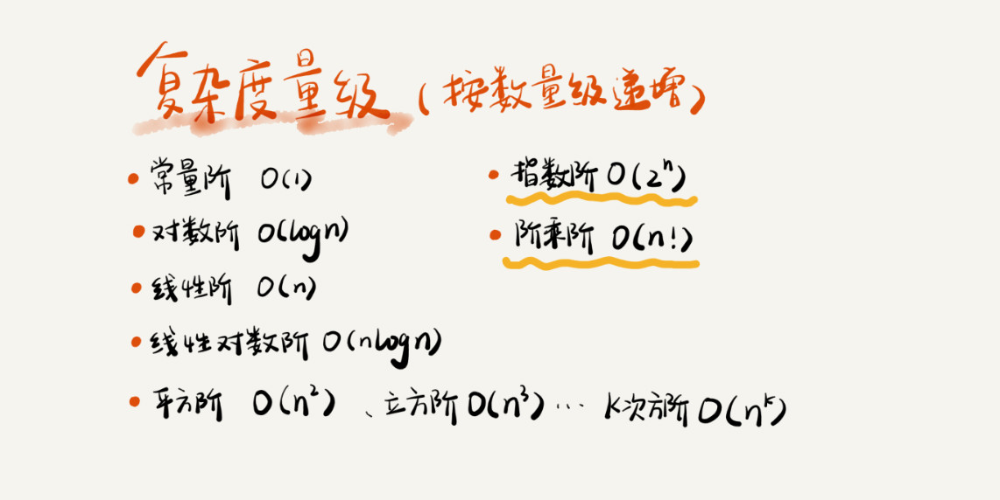

# 时间算法复杂度

## 大O复杂度表示法

```C++
 int cal(int n) {
   int sum = 0;
   int i = 1;
   for (; i <= n; ++i) {
     sum = sum + i;
   }
   return sum;
 }
```

>上述代码执行时间为 => (2n+2)*unit_time。

```C++
  int cal(int n) {
   int sum = 0;
   int i = 1;
   int j = 1;
   for (; i <= n; ++i) {
     j = 1;
     for (; j <= n; ++j) {
       sum = sum +  i * j;
     }
   }
 }
```

>上述代码执行时间为 => $(2n2+2n+3)$*unit_time。

**所有代码的执行时间 T(n) 与每行代码的执行次数 n 成正比。**

 = O(f(n))")

公式中不需要记录低价、常量、系数三个部分，只需要记录最大的量级就好。

## 时间复杂度

```C++
 int cal(int n) {
   int sum = 0;
   int i = 1;
   for (; i <= n; ++i) {
     sum = sum + i;
   }
   return sum;
 }
```

上述代码时间复杂度为 $O(2n) => O(n)$。

### 1.加法法则：总复杂度等于量级最大的那段代码复杂度

```C++
int cal(int n) {
   int sum_1 = 0;
   int p = 1;
   for (; p < 100; ++p) {
     sum_1 = sum_1 + p;
   }
 
   int sum_2 = 0;
   int q = 1;
   for (; q < n; ++q) {
     sum_2 = sum_2 + q;
   }
 
   int sum_3 = 0;
   int i = 1;
   int j = 1;
   for (; i <= n; ++i) {
     j = 1; 
     for (; j <= n; ++j) {
       sum_3 = sum_3 +  i * j;
     }
   }
 
   return sum_1 + sum_2 + sum_3;
 }
```

代码中的时间算法复杂度为 $O(2n + 2n + n^2 + 7) => O(n^2)$

### 2.乘法法则： 嵌套代码的复杂度等于嵌套内外代码复杂度的乘积

```C++
int cal(int n) {
   int ret = 0; 
   int i = 1;
   for (; i < n; ++i) {
     ret = ret + f(i);
   } 
 } 
 
 int f(int n) {
  int sum = 0;
  int i = 1;
  for (; i < n; ++i) {
    sum = sum + i;
  } 
  return sum;
 }
```

代码中的时间算法复杂度为 $O(n^2)$
cal方法中的时间复杂度是O(n)。f方法中的时间复杂度是O(n)。
$T(n) = T1(n) * T2(n) = O(n*n) = O(n^2)$

### 3.几种常见时间复杂度实例分析



* 非多项式量级 （NP时间复杂度）
  * 指数阶
  * 阶乘阶

***

* 多项式量级
  * 常量阶
    * 不存在循环语句、递归语句的代码都是常量阶
  * 对数阶

    ```C++
      i=1;
      while (i <= n)  {
        i = i * 2;
      }
    ```

    可以看成等比数列
    $2^0$ $2^1$ $2^2$ ... $2^k$ ... $2^n$ = n
    $2^x$ = n 等价于 $x=log_2^n$
    所以时间复杂度为$O(log_2^n)$

    在采用大 O 标记复杂度的时候，可以忽略系数，即$O(Cf(n)) = O(f(n))$
    如果一段代码的时间复杂度是 $O(logn)$，我们循环执行 n 遍，时间复杂度就是 $O(nlogn)$ 了
    归并排序、快速排序的时间复杂度都是 $O(nlogn)$

  * O(m+n)、O(m*n)
